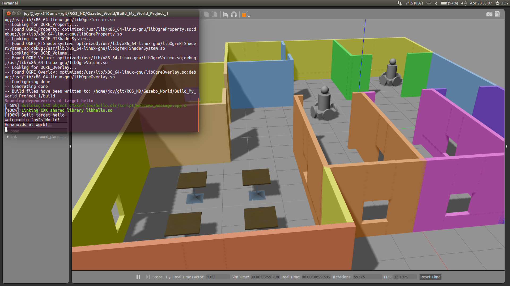
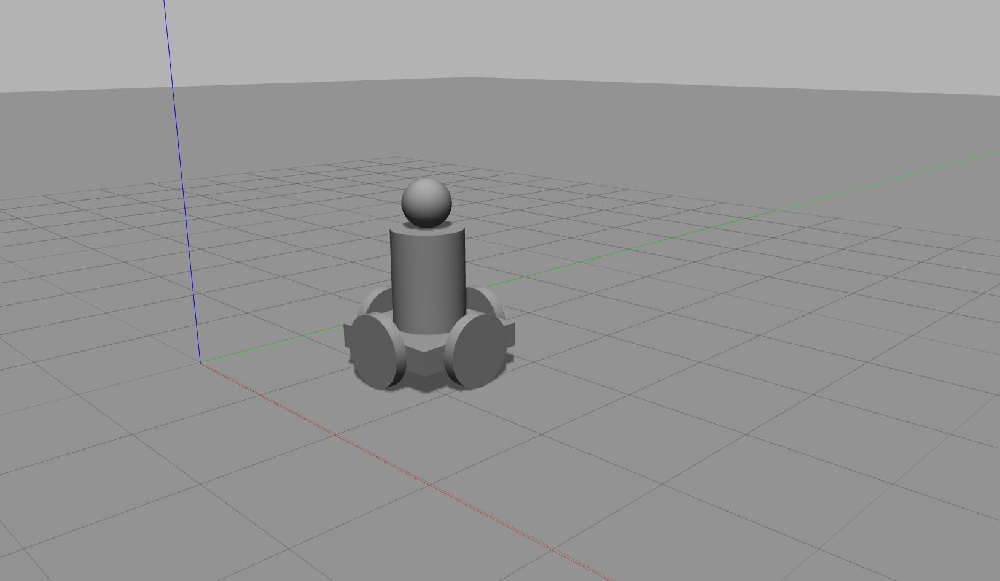
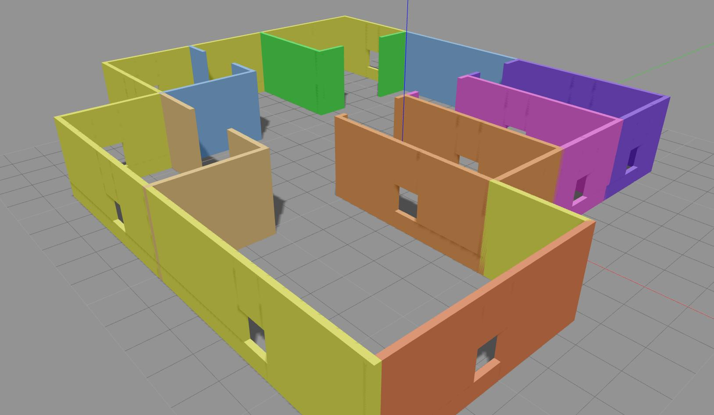
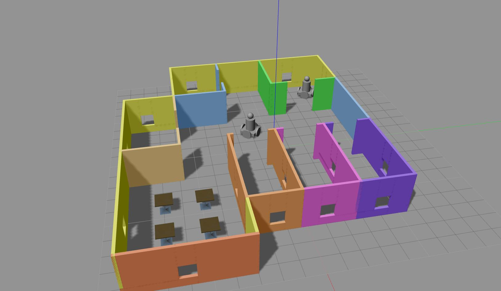

# Build My World
[Project 1](https://classroom.udacity.com/nanodegrees/nd209/parts/852e258d-b6c9-4823-b0af-0a7f77379583/modules/9523f932-cb38-4eb4-ae6c-b89ecb29e30c/lessons/962ef39a-4b29-4756-8dc1-05aca4075619/project) of Udacity's Robotics Software Engineer Nanodegree Program

  

## Overview
In this project we will create a simulation world in Gazebo using Building Editor tool and Model Editor tool in Gazebo.

#### Objectives
1. Build a single floor wall structure using the **Building Editor** tool in Gazebo. Apply at least one feature, one color, and optionally one texture to your structure. Make sure there's enough space between the walls for a robot to navigate.  
2. Model any object of your choice using the **Model Editor** tool in Gazebo. Your model links should be connected with joints.  
3. Import your structure and two instances of your model inside an empty **Gazebo World**.  
4. Import at least one model from the **Gazebo online library** and implement it in your existing Gazebo world.  
5. Write a C++ **World Plugin** to interact with your world. Your code should display “Welcome to ’s World!” message as soon as you launch the Gazebo world file.

## Project Description
Directory Structure
```
.Build-My-World                    # Build My World Project 
├── model                          # Model files 
│   ├── humanoid
│   │   ├── model.config
│   │   ├── model.sdf
│   ├── mybuilding
│   │   ├── model.config
│   │   ├── model.sdf
├── script                         # Gazebo World plugin C++ script      
│   ├── welcome_message.cpp
├── world                          # Gazebo main World containing models 
│   ├── myworld
├── CMakeLists.txt                 # Link libraries 
├── deploy.sh                      # Shell script to run this project
```

### Robot
I made a holonomic four wheel drive robot with human like structure for this project using Gazebo's Model Editor tool.


### Building
I made one floor structure with multiple rooms, doors, windows and colors using Gazebo's Building Editor tool. 


### World
I imported my building, 2 instances of my robot and cafe tables from Gazebo's online library in to my world.


## Run the project
- Clone this repository
- From `Build-My-World` directory run the following code in terminal:
```
source deploy.sh
```
This will create a build directory, compile your code, export the `GAZEBO_PLUGIN_PATH` to build directory path and launch the world file in gazebo.