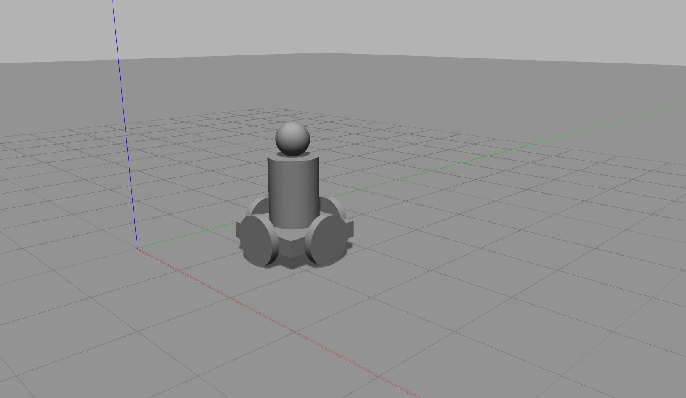
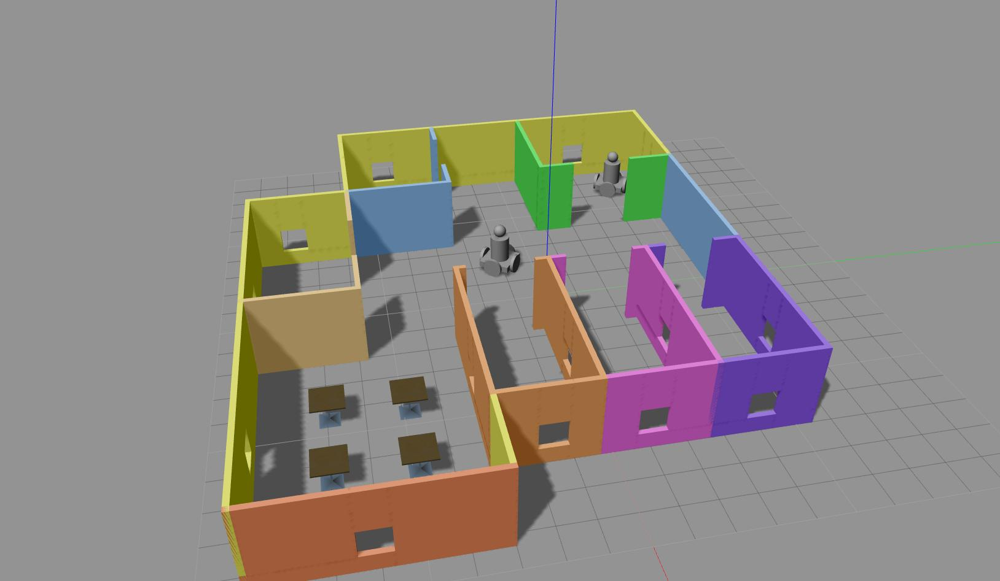

This project is a part of submission for Udacity's Robotics Software Nanodegree project "BUILD MY WORLD".

#### Files included:
- model
    - humanoid_robot
        - model.config
        - model.sdf
    - mybuilding
        - model.config
        - model.sdf
- script
    - welcome_message.cpp
- world
    - my_world
- CMakeLists.txt
- deploy.sh
- images
    - humanoid_robot.jpg
    - mybuilding.jpg
    - myworld.jpg

## Execute the following command in terminal from the project directory to run this project:
```
source deploy.sh
```
# Model
### Robot
I have made a holonomic four wheel drive robot with human like structure for this project using Gazebo's Model Editor tool.



### Building
I have made a building with multiple rooms, doors, windows and colors using Gazebo's Building Editor tool. 


### World
I imported my building, 2 instances of my robot and cafe tables from Gazebo's online library in to my world.


