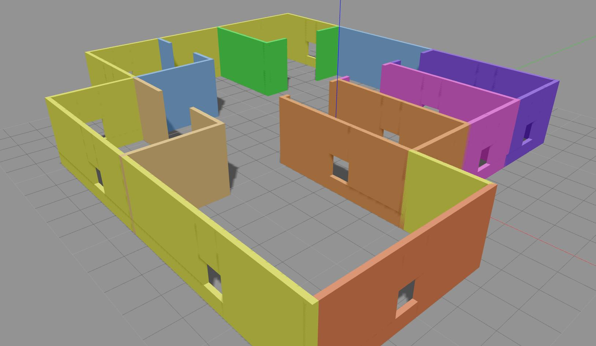

This project is a part of submission for Udacity's Robotics Software Nanodegree project "BUILD MY WORLD".

#### Files included:
- model
    - humanoid_robot
        - model.config
        - model.sdf
    - mybuilding
        - model.config
        - model.sdf
- script
    - welcome_message.cpp
- world
    - my_world
- CMakeLists.txt
- deploy.sh

## Execute the following steps in terminal from the project directory to run this project:
```
./deploy.sh
cd build
export GAZEBO_PLUGIN_PATH=$PWD
cd ../world
gazebo my_world
```
# Model
### Robot
I have made a holonomic four wheel drive robot with human like structure for this project using Gazebo's Model Editor tool.


### Building
I have made a building with multiple rooms, doors, windows and colors. 



### World
I imported my building, 2 instances of my robot and cafe table from Gazebo's online libraray in to my world.

