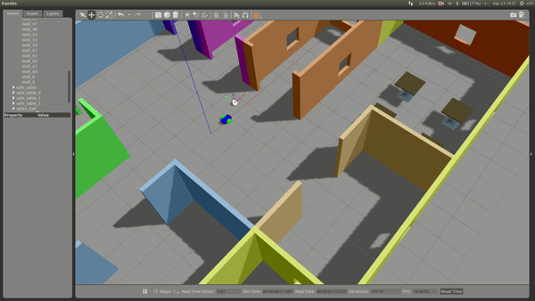

# Go Chase It
[Project 2](https://classroom.udacity.com/nanodegrees/nd209/parts/1f349ee0-9c40-4964-a6a8-4e0818a15fde/modules/d0fbb2f2-55d1-4217-8116-a52ac989c07f/lessons/21c5607d-1627-46da-a4b7-081e8366de5a/project) of Udacity's Robotics Software Engineer Nanodegree Program



## Project Overview
In this project we will simulate a robot with differential drive to chase a white ball inside the world created in Build My World project in gazebo. 
The robot has a camera to see its surrounding, hokuyo LIDAR sensor to map its surroundings and it moves using differential drive plugin.
The robot uses process_image node to detect white ball and then drives towards the ball using the drive_bot node.

### Objectives
1. `drive_bot`:
- Create a my_robot ROS package to hold your robot, the white ball, and the world.
- Design a differential drive robot with the Unified Robot Description Format. Add two sensors to your robot: a lidar and a camera. Add Gazebo plugins for your robot’s differential drive, lidar, and camera. The robot you design should be significantly different from the one presented in the project lesson. Implement significant changes such as adjusting the color, wheel radius, and chassis dimensions. Or completely redesign the robot model! After all you want to impress your future employers :-D
- House your robot inside the world you built in the **Build My World** project.
- Add a white-colored ball to your Gazebo world and save a new copy of this world.
- The `world.launch` file should launch your world with the white-colored ball and your robot.

2. `ball_chaser`:
- Create a `ball_chaser` ROS package to hold your C++ nodes.
- Write a `drive_bot` C++ node that will provide a `ball_chaser/command_robot` service to drive the robot by controlling its linear x and angular z velocities. The service should publish to the wheel joints and return back the requested velocities.
- Write a `process_image` C++ node that reads your robot’s camera image, analyzes it to determine the presence and position of a white ball. If a white ball exists in the image, your node should request a service via a client to drive the robot towards it.
- `The ball_chaser.launch` should run both the `drive_bot` and the `process_image` nodes.

## Project Description
Directory Structure
```
 .Go-Chase-It                          # Go Chase It Project
    ├── my_robot                       # my_robot package                   
    │   ├── launch                     # launch folder for launch files   
    │   │   ├── robot_description.launch
    │   │   ├── world.launch
    │   ├── meshes                     # meshes folder for sensors
    │   │   ├── hokuyo.dae
    │   ├── urdf                       # urdf folder for xarco files
    │   │   ├── my_robot.gazebo
    │   │   ├── my_robot.xacro
    │   ├── world                      # world folder for world files
    │   │   ├── joy.world
    │   ├── CMakeLists.txt             # compiler instructions
    │   ├── package.xml                # package info
    ├── ball_chaser                    # ball_chaser package                   
    │   ├── launch                     # launch folder for launch files   
    │   │   ├── ball_chaser.launch
    │   ├── src                        # source folder for C++ scripts
    │   │   ├── drive_bot.cpp
    │   │   ├── process_image.cpp
    │   ├── srv                        # service folder for ROS services
    │   │   ├── DriveToTarget.srv
    │   ├── CMakeLists.txt             # compiler instructions
    │   ├── package.xml                # package info                  
    └──
```
## Setup 
---
### Prerequisites
- Linux 16.04
- Gazebo >= 7.0
- ROS Kinetic
- make >= 4.1
- gcc/g++ >= 5.4
---
### Run the project
- Clone the repository
```
$ git clone https://github.com/Joy110900/ROS_ND.git
```
- Initialise a catkin workspace
```
$ mkdir -p /catkin_ws/src
$ cd /catkin/src
$ catkin_init_workspace
```
- Copy folders `my_robot` and `ball_chaser` from cloned repository `ROS_ND/Go-Chase_It/` to your catkin workspace `catkin_ws/src`
- Build the catkin package
```
$ cd /catkin_ws
$ catin_make
```
- Launch the robot inside gazebo world. This can be done by launching the `world.launch` file:
```
$ cd /catkin_ws
$ source devel/setup.bash
$ roslaunch my_robot world.launch
```
- Run `drive_bot` and `process_image`. This can be done by executing `ball_chaser.launch`:
```
$ cd /catkin_ws
$ source devel/setup.bash
$ roslaunch ball_chaser ball_chaser.launch
``` 
- To visualize the robot’s camera images, you can subscribe to camera RGB image topic from RViz. Or you can run the rqt_image_view node:
```
$ cd /catkin_ws/
$ source devel/setup.bash
$ rosrun rqt_image_view rqt_image_view  
```
- Now place the white ball at different positions in front of the robot and see if the robot is capable of chasing the ball!
---