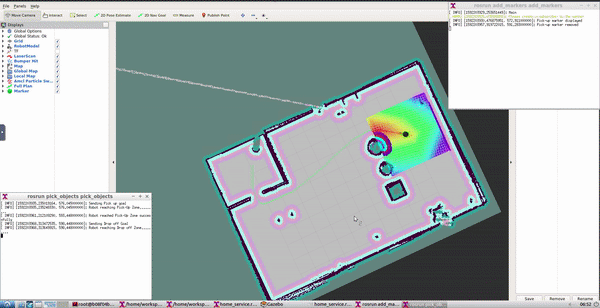

# Home Service Robot
[Project 4](https://classroom.udacity.com/nanodegrees/nd209/parts/75c8f42b-c844-4f61-b3c6-521956c5cf70/modules/de8554d1-78db-4d1d-9a78-9b9a93d2879e/lessons/1ccf2893-a07b-41c5-b2ed-7cdc48bd26fc/project) of Udacity's Robotics Software Engineer Nanodegree Program



## Project Overview
In this project, we will simulate turtlebot 2 kobuki base in gazebo environment and have it autonomously navigate through our map which was generated using SLAM to a predefined location where it will pick up a virtual object and then drop it in another location. We will use RVIZ to visualise the virtual markers.

### Objectives
1. Map the world using gmapping and turtlebot teleop to control our robot using a keyboard. We will map the world by moving our robot in the gazebo world and use laser scans to map surroundings and save the map for further use.
2. Create a `pick_objects` node which can autonomously navigate to any location in the map using AMCL.
3. Create a `add_markers` node that adds virtual markers to the pick-up and drop off location which can be seen in Rviz. 
    - It also communicates with Odom to get the robot's position in order to simulate pick up and drop off action. 
    - It will publish a marker in the pick-up location until the robot reaches there. When the robot reaches pickup zone the marker will be deleted and will reappear at the drop off zone when the robot reaches there.

## Project Description
Directory Structure
```
.Home-Service-Robot
    ├── slam_gmapping                  # gmapping_demo.launch file                   
    │   ├── gmapping
    │   ├── ...
    ├── turtlebot                      # keyboard_teleop.launch file
    │   ├── turtlebot_teleop
    │   ├── ...
    ├── turtlebot_interactions         # view_navigation.launch file      
    │   ├── turtlebot_rviz_launchers
    │   ├── ...
    ├── turtlebot_simulator            # turtlebot_world.launch file 
    │   ├── turtlebot_gazebo
    │   ├── ...
    ├── scripts                         # shell scripts files
    │   ├── test_slam.sh                # to move the robot around and map our world
    |   ├── test_navigation.sh          # to test navigation node of our robot
    |   ├── pick_objects.sh             # to test navigation to given coordinates
    |   ├── add_markers.sh              # to test markers in rviz
    |   ├── home_service.sh             # launch our robot
    ├──rvizConfig                      
    │   ├── home_service.rviz          # rviz configuration for our robot
    ├──pick_objects                    # pick_objects C++ node
    │   ├── src/pick_objects.cpp
    │   ├── ...
    ├──add_markers                     # add_marker C++ node
    │   ├── src/add_markers.cpp
    │   ├── src/add_markers_test.cpp
    │   ├── ...
    ├──worlds                     # add_marker C++ node
    │   ├── joy.world                   # Gazebo World
    │   ├── map.pgm                     # Map generated using SLAM
    │   ├── map.yaml
    └──
```
## Setup 
---
### Prerequisites
- Linux 16.04
- Gazebo >= 7.0
- ROS Kinetic
- make >= 4.1
- gcc/g++ >= 5.4
---
### Run the project
- Clone the repository
```
$ git clone https://github.com/Joy110900/ROS_ND.git
```
- Initialise a catkin workspace
```
$ mkdir -p /catkin_ws/src
$ cd /catkin/src
$ catkin_init_workspace
```
Copy all folders from cloned repository `ROS_ND/Home-Service-Robot/` to your catkin workspace `catkin_ws/src`

- Launch the final project by executing home_service.sh. This will launch our robot in gazebo, rviz with our configuration file and all the nodes.
```
$ cd /catkin_ws/src/scripts/
$ ./home_service.sh
```
- Now the robot will go to the pick up zone, wait for 5 seconds and then go to the drop off location.
- To run any other file 
```
$ cd /catkin_ws/src/scripts/
$ ./(file name).sh
```

[Watch Full Video](https://youtu.be/0P1MzECHfGA)