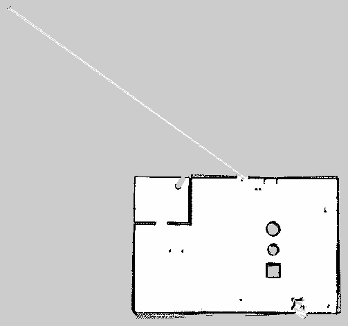

# Map My World
[Project 4](https://classroom.udacity.com/nanodegrees/nd209/parts/3882e4dc-c5d8-4f7e-9889-82c8e97fef6a/modules/a181a990-4654-4c33-a839-ad395365a1cb/lessons/c6b200bf-a0a5-456c-a988-d2d4cda5e003/concepts/a279f0b7-5fff-4823-9426-28383e3b4aa6) of Udacity's Robotics Software Engineer Nanodegree Program



## Project Overview
In this project we will create a 2D occupancy grid and 3D octomap from a simulated environment using your own robot with the RTAB-Map package.

### Objectives
1. You will develop your own package to interface with the `rtabmap_ros` package.

2. You will build upon your localization project to make the necessary changes to interface the robot with RTAB-Map. An example of this is the addition of an RGB-D camera.

3. You will ensure that all files are in the appropriate places, all links are properly connected, naming is properly setup and topics are correctly mapped. Furthermore you will need to generate the appropriate launch files to launch the robot and map its surrounding environment.

4. When your robot is launched you will `teleop` around the room to generate a proper map of the environment.


## Project Description
Directory Structure
```
 .Map-My_World                     
    ├── my_robot                       # my_robot package                   
    │   ├── launch                     # launch files   
    │   │   ├── robot_description.launch
    │   │   ├── world.launch
    |   |   ├── amcl.launch
    │   ├── meshes                     
    │   │   ├── hokuyo.dae
    │   ├── urdf                       
    │   │   ├── my_robot.gazebo
    │   │   ├── my_robot.xacro
    │   ├── world                      
    │   │   ├── joy.world
    ├── maps                            # map generated using RTAB-Map
    │   │   ├── joy.pgm
    │   │   ├── joy.yaml
    │   ├── CMakeLists.txt              # compiler instructions
    │   ├── package.xml                 # package info
    ├── navigation                      # Standard package 
    ├── teleop_twist_keyboard           # Standard package 
    ├── pgm_map_creator                 # Standard package                   
```
## Setup 
---
### Prerequisites
- Linux 16.04
- Gazebo >= 7.0
- ROS Kinetic
- make >= 4.1
- gcc/g++ >= 5.4
---
### Run the project
- Clone the repository
```
$ git clone https://github.com/Joy110900/ROS_ND.git
```
- Initialise a catkin workspace
```
$ mkdir -p /catkin_ws/src
$ cd /catkin/src
$ catkin_init_workspace
```
Copy all folders from cloned repository `ROS_ND/Map-My-World/` to your catkin workspace `catkin_ws/src` and then build your packages and source repository.
```
$ cd /catkin_ws/src
$ catkin_make
$ souce devel/setup.bash
```

- Launch mapping node
- Move around in your world using teleop_twist_keyboard to create map of your environment  
```
$ roslaunch my_robot mapping.launch
```