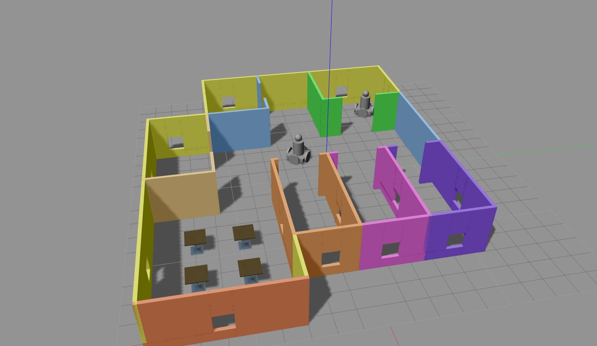

# Robot Operating Software Nanodegree

This repository contains different project files from Udacity's [Robotics Software Engineer](https://classroom.udacity.com/nanodegrees/nd209/dashboard/overview) Nano degree.

1. Gazebo World
    - Created robot models, using Gazebo's Model editor.
    - Created building with multiple features like doors, windows, tables, different colors.
    - Created a world with my building and 2 instances of humanoid robot created by me. 

2. Go Chase It
    - Design and builda mobile robot, and house it in a world. 
    - Then program the robot to chase a white colored ball using C++ nodes.

3. Where am I?
    - Use AMCL algorithm in ROS to localize your robot in your world in gazebo.

4. Map My World
    - Deploy RTAB-Map on the simulated robot to create 2D and 3D maps of its environment using teleop to move robot around.

5. Home Service Robot
    - Program a home service robot that will autonomously map an environment and navigate to pickup and deliver objects!

## Run the projects
* Instructions for each project is given in the respective directory.