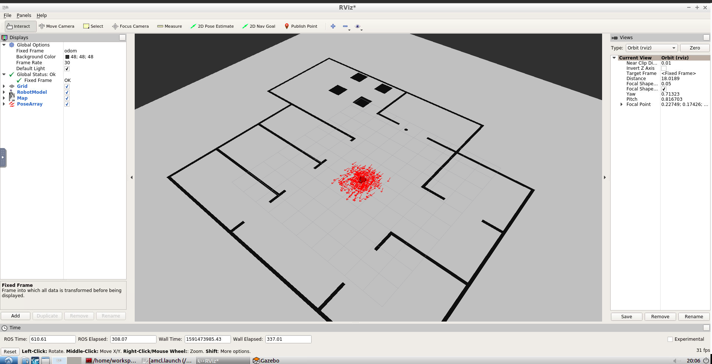

# Where Am I?
[Project 4](https://classroom.udacity.com/nanodegrees/nd209/parts/a431d446-05df-4641-9e3d-79e1d55a7a2f/modules/469bf8d2-a532-4ce1-b163-7a7b62c81de7/lessons/7dfe4265-e484-4efc-89e7-088540ff6720/concepts/2ab0200c-3c61-4ca6-bfb6-2b33cf81b743) of Udacity's Robotics Software Engineer Nanodegree Program



## Project Overview
In this project we will learn to utilize ROS AMCL package to accurately localize a mobile robot inside a map in the Gazebo simulation environments.

### Objectives
1. Create a ROS package that launches a acustom robot model in a custom Gazebo world.
2. Utilize the ROS AMCL package and the Tele-Operation / Navigation Stack to localize the robot.
3. Explore, add, and tune specific parameters corresponding to each package to achieve the best possible localization results.

## Project Description
Directory Structure
```
 .Where-Am-I                          # Where Am I Project
    ├── my_robot                       # my_robot package                   
    │   ├── launch                     # launch files   
    │   │   ├── robot_description.launch
    │   │   ├── world.launch
    |   |   ├── amcl.launch
    │   ├── meshes                     
    │   │   ├── hokuyo.dae
    │   ├── urdf                       
    │   │   ├── my_robot.gazebo
    │   │   ├── my_robot.xacro
    │   ├── world                      
    │   │   ├── joy.world
    |   ├── maps                       # map generated using pgm_map_creator
    │   │   ├── joy.pgm
    │   │   ├── joy.yaml
    │   ├── CMakeLists.txt             # compiler instructions
    │   ├── package.xml                # package info
    ├── pgm_map_creator                # Standard package                   
```
## Setup 
---
### Prerequisites
- Linux 16.04
- Gazebo >= 7.0
- ROS Kinetic
- make >= 4.1
- gcc/g++ >= 5.4
---
### Run the project
- Clone the repository
```
$ git clone https://github.com/Joy110900/ROS_ND.git
```
- Initialise a catkin workspace
```
$ mkdir -p /catkin_ws/src
$ cd /catkin/src
$ catkin_init_workspace
```
Copy all folders from cloned repository `ROS_ND/Where-Am-I/` to your catkin workspace `catkin_ws/src` and then build your packages and source repository.
```
$ cd /catkin_ws/src
$ catkin_make
$ souce devel/setup.bash
```

- Launch localization node  
```
$ roslaunch my_robot amcl.launch
```